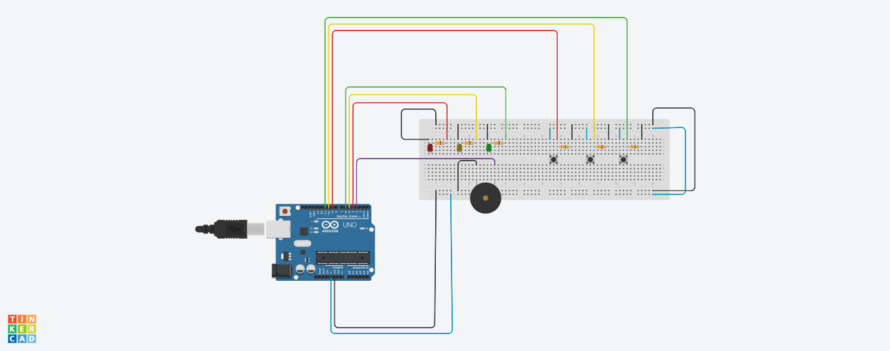

# Genius Game

The classic game using Arduino and Javascript.

## How to use
Just follow the schema below and run in Johnny five.

PS: The Piezo (sound emitter) are optional. Just turn the variable `SOUND_ON = false` on index.js.

## Schema:

